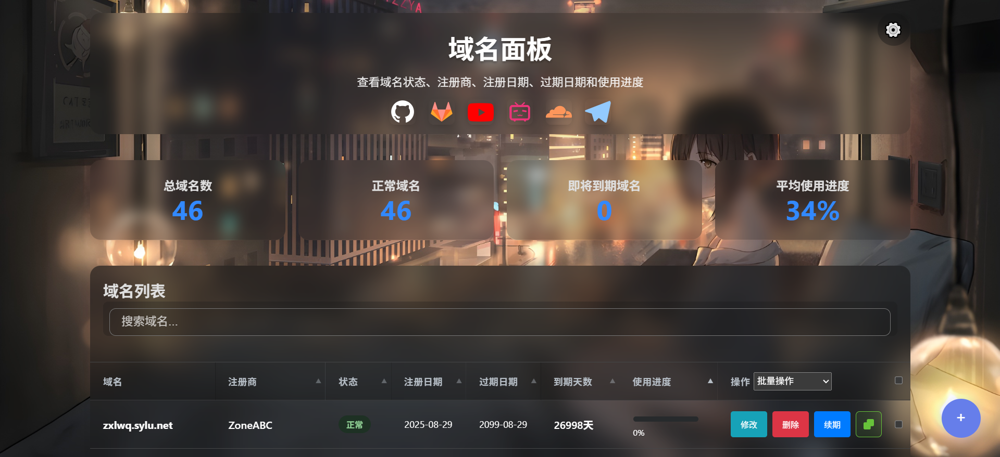

# 域名展示面板（Cloudflare Pages+D1 版）

一个现代化的域名管理与展示面板，支持域名状态监控、到期提醒（支持 Telegram、微信、QQ、邮件多方式）、可视化展示，适合个人和部署。

<p align="center">
  
</p>

<p align="center">
  <a href="https://opensource.org/licenses/MIT">
    
  </a>
  <a href="https://reactjs.org/">
    
  </a>
  <a href="https://vitejs.dev/">
    
  </a>
  <a href="https://www.typescriptlang.org/">
    
  </a>
  <a href="https://pages.cloudflare.com/">
    
  </a>
</p>



---


## 🚀 快速部署

### 1. 推送代码到 GitHub
Fork该项目到你的 GitHub 仓库

### 2. Cloudflare Pages 部署
1. 进入 [Cloudflare Pages](https://dash.cloudflare.com)，点击"创建项目"
2. 连接你的 GitHub 仓库
3. 框架预设：React (Vite)

## 🔧 环境变量配置
### 管理员密码
```
PASSWORD
```
### 通过Cloudflare API 添加域名
创建帐户API令牌，权限：只需区域读取权限
```
CF_KEY
```
### WebDAV 备份配置
```
WEBDAV_URL
```
```
WEBDAV_USER
```
```
WEBDAV_PASS
```
### Telegram 通知配置
```
TG_BOT_TOKEN
```
```
TG_USER_ID
```

### 微信 Server酱 通知配置
```
WECHAT_KEY
```
### QQ Qmsg酱 通知配置
```
QQMSG_KEY
```
```
QQMSG_QQ
```


---


### 3. 配置 D1 数据库
1. 在 Cloudflare 控制台创建 D1 数据库，命名为 `domain`
2. 在 Pages 项目设置中绑定 D1 数据库，绑定名为 `DB`
3. 在 D1 控制台执行以下 SQL 初始化表结构：

```sql
CREATE TABLE IF NOT EXISTS domains (
  id INTEGER PRIMARY KEY AUTOINCREMENT,
  domain TEXT UNIQUE NOT NULL,
  registrar TEXT NOT NULL,
  register_date TEXT NOT NULL,
  expire_date TEXT NOT NULL,
  status TEXT NOT NULL DEFAULT 'active',
  renewUrl TEXT
);

CREATE TABLE IF NOT EXISTS logs (
  id INTEGER PRIMARY KEY AUTOINCREMENT,
  type TEXT NOT NULL,
  action TEXT NOT NULL,
  details TEXT NOT NULL,
  status TEXT NOT NULL,
  timestamp DATETIME DEFAULT CURRENT_TIMESTAMP,
  user_agent TEXT,
  ip_address TEXT,
  device_info TEXT,
  domain TEXT,
  notification_method TEXT,
  error_details TEXT
);

CREATE TABLE IF NOT EXISTS notification_settings (
  id INTEGER PRIMARY KEY AUTOINCREMENT,
  warning_days TEXT NOT NULL,
  notification_enabled TEXT NOT NULL,
  notification_interval TEXT NOT NULL,
  notification_method TEXT NOT NULL,
  created_at DATETIME DEFAULT CURRENT_TIMESTAMP,
  updated_at DATETIME DEFAULT CURRENT_TIMESTAMP
);

CREATE INDEX IF NOT EXISTS idx_domains_domain ON domains(domain);
CREATE INDEX IF NOT EXISTS idx_domains_status ON domains(status);
CREATE INDEX IF NOT EXISTS idx_domains_expire_date ON domains(expire_date);
CREATE INDEX IF NOT EXISTS idx_logs_timestamp ON logs(timestamp);
CREATE INDEX IF NOT EXISTS idx_logs_type ON logs(type);
CREATE INDEX IF NOT EXISTS idx_logs_domain ON logs(domain);
```

